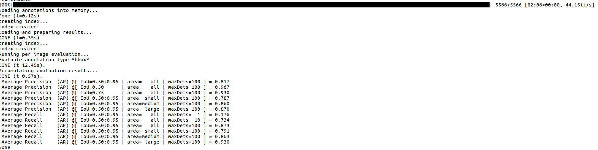
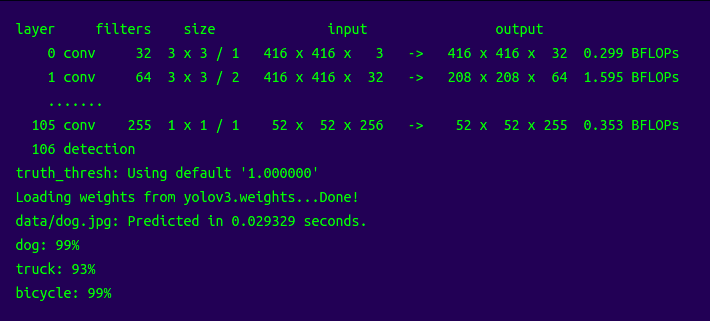

# Steps to obtain the accuracy for TensorRT engines
* <b>TensorRT engine creation</b>
* <b>Accuracy calculation</b>

<h3>Software Requirements</h3> 
<b> 1. TensorRT (version preferably >= 5) </b>  
<b> 2. ONNX (sudo pip3 install onnx==1.4.1)---> The present yolo_to_onnx.py works only with version 1.4.1 of ONNX </b>  
<b> 3. Pycotools (Used to calculate the MAP) </b>  
<b> 4. Tested on Ubuntu 18.04 and Python3 </b>  

<h3> Steps to create the TensorRT engine</h3>
1. Go to <i>cd tensorrt_accuracy/yolov3_onnx </i>  
2. Generate the onnx model from the weights and the cfg file( <i>python3 tinyYolov3_to_onnx.py</i>)  
3. After the onnx is generated, run <i> python3 onnx_to_tensorrt.py --m yolov3-tiny-416</i>(The type of model can be changed inside the onnx_to_tensorrt.py file)  
4. This will generate the model with trt extension. 

<h3> Installing Pycocotools</h3>
1. Clone the repo: git clone https://github.com/waleedka/coco  
2. python3 PythonAPI/setup.py build_ext install 

# Accuracy Calculation
1. Open eval_yolov3.py inside the directory tensorrt_accuracy.  
2. Give the path to the image dataset along with the annotations in json format(format attached in the folder). 
3. Run <i>python3 eval_yolov3.py --m model</i> (Here model is either tiny-yolo or yolo. Give the name of the trt engine generated above). 
4. This will go through all the images and the annotations and will generate a file with the format .json. After it, the COCOeval of pycocotools will evaluate the json file and generate the summary of the results (Both precison and recall). The dummy screenshot of the output is attached.
 
 5. Note that in order to get the precision and recall for individual classes, you need to specify the class in the code (<b>Line no 120 of eval_yolo.py</b>). This is the link to the code(https://github.com/cocodataset/cocoapi/blob/master/PythonAPI/pycocotools/cocoeval.py) 

<h3> Additional Changes needed</h3>
 To obtain precision and recall at some fixed IOU(say 0.75), you can edit the <b>cocoeval.py</b> (Edit function Summarize in the file) file present in the system as pycocotools is installed. <i>cocoeval.py</i> is present at the location <i> ~/coco/PythonAPI/pycocotools/cocoeval.py</i> (Assuming the pycocotools is installed in the home directory)

# Steps to obtain the accuracy for Darknet Models
1. <i> cd darknet </i>  
2. <i> make -j 4 </i> ( This will build all the necessary files)  
3. Do a basic test whether darknet is working fine. <i>./darknet detect yolov3-tiny-416.cfg yolov3-tiny-416.weights data/dog.jpg </i>  
 

<h3> Command to obtain recall</h3>
 ./darknet detector recall cfg/voc.data cfg/yolov3-tiny-416.cfg yolov3-tiny-416.weights (voc.data contains the paths to the training and the test dataset)

<h3> Command to obtain MAP </h3>
./darknet detector map cfg/voc.data cfg/yolov3-tiny-416.cfg yolov3-tiny-416.weights 

# Dataset used in our evaluation
We use our custom traffic dataset for the evaluation. It can be found at 
# Contact
For any issues related to the code, you can contact me at <i>omais.shafi@gmail.com</i>
  
